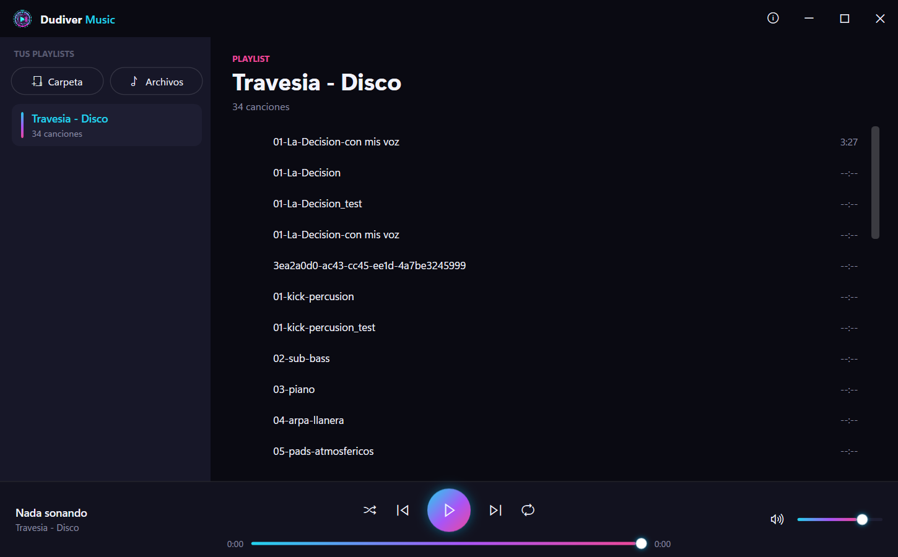

<p align="center">
  
</p>

<h1 align="center">Dudiver Music</h1>

<p align="center">
  <strong>Drop a folder, get a playlist, press play. A modern, dead-simple music player for Windows.</strong><br>
  <em>Arrastrá una carpeta, se arma la playlist, dale play. Un reproductor de música moderno y sin vueltas para Windows.</em>
</p>

<p align="center">
  
  
  
  
  
</p>

<p align="center">
  <a href="#english"><strong>English</strong></a> ·
  <a href="#español"><strong>Español</strong></a> ·
  <a href="#about--acerca-de"><strong>About</strong></a>
</p>

<p align="center">
  
</p>

---

## English

### What is it?

**Dudiver Music** is a lightweight, beautiful music player for Windows 10/11. There's no library to import, no accounts, no clutter. Drag a folder of songs onto the window and it instantly becomes a playlist named after the folder. Press play. That's it.

Built with WPF on .NET 10, it uses a modern neon-dark interface inspired by the Dudiver audio brand, and plays through the audio device **you** choose — so your music can go to your headphones while the rest of Windows keeps using its default output.

### Features

- 🎵 **Drag & drop** a folder → instant playlist with the folder's name (natural sort, subfolders included).
- 📄 **Drag or add individual files** (one or many) → build a playlist your way.
- ✏️ **Rename** playlists inline, delete them, and everything **saves itself**.
- ⏯️ Full transport: play / pause / previous / next, a draggable **progress bar**, **volume** & mute, **shuffle** and **repeat**.
- 🎧 **Choose the audio output** (speakers, headphones, HDMI…) independent of the Windows default — the rest of the system keeps its own output.
- 🌐 **Bilingual UI** — English / Español, switchable live from the globe icon (no restart).
- 💾 **Remembers** your playlists, volume, output device and language.
- ⚡ Zero external dependencies for playback — no codecs to install for the common formats.

### Supported formats

| Format | Notes |
|--------|-------|
| **MP3** | Everywhere |
| **WAV** | Uncompressed |
| **FLAC** | Lossless |
| **M4A / AAC** | Apple / YouTube audio |
| **WMA** | Windows Media |
| OGG / OPUS | Play if the matching Windows codec is installed |

Playback is handled by **NAudio** over **WASAPI (shared mode)** with Media Foundation decoding.

### How to use

1. **Open Dudiver Music.**
2. **Drag a folder** with music onto the window — or click **Folder** / **Files** in the sidebar. A folder becomes a playlist named after it; loose files become a playlist too.
3. **Click a song** to play. Use the bottom bar for pause, previous/next, seek, volume, shuffle and repeat.
4. **Rename** a playlist: hover it and click the ✏️ pencil (Enter confirms, Esc cancels).
5. **Pick your audio output**: click the speaker icon next to the volume and choose a device (e.g. your headphones). Windows keeps using its own default for everything else.
6. **Change language**: click the 🌐 globe at the top-right and pick English or Español.

### Build from source

Requirements: **.NET 10 SDK** on Windows 10/11.

```bash
cd DudiverMusic
dotnet run            # build & launch
# or
dotnet build -c Release
```

The output is a self-contained WPF app under `DudiverMusic/bin`. NuGet restores **NAudio** and **CommunityToolkit.Mvvm** automatically.

---

## Español

### ¿Qué es?

**Dudiver Music** es un reproductor de música liviano y bonito para Windows 10/11. Sin biblioteca que importar, sin cuentas, sin líos. Arrastrás una carpeta con canciones a la ventana y al instante se convierte en una playlist con el nombre de la carpeta. Le das play. Listo.

Hecho con WPF sobre .NET 10, tiene una interfaz oscura neón inspirada en la marca de audio Dudiver, y reproduce por el dispositivo de audio que **vos** elijas — así tu música puede ir a los audífonos mientras el resto de Windows sigue usando su salida predeterminada.

### Funciones

- 🎵 **Arrastrá una carpeta** → playlist al instante con el nombre de la carpeta (orden natural, incluye subcarpetas).
- 📄 **Arrastrá o agregá archivos sueltos** (uno o varios) → armá la playlist a tu manera.
- ✏️ **Renombrá** playlists en el momento, eliminalas, y todo **se guarda solo**.
- ⏯️ Controles completos: play / pausa / anterior / siguiente, **barra de progreso** arrastrable, **volumen** y silencio, **aleatorio** y **repetir**.
- 🎧 **Elegí la salida de audio** (parlantes, audífonos, HDMI…) independiente del predeterminado de Windows — el resto del sistema mantiene su salida.
- 🌐 **Interfaz bilingüe** — Español / English, se cambia en vivo desde el ícono de globo (sin reiniciar).
- 💾 **Recuerda** tus playlists, el volumen, la salida de audio y el idioma.
- ⚡ Sin dependencias externas para reproducir — no hay códecs que instalar para los formatos comunes.

### Formatos soportados

| Formato | Notas |
|---------|-------|
| **MP3** | En todos lados |
| **WAV** | Sin comprimir |
| **FLAC** | Sin pérdida |
| **M4A / AAC** | Audio de Apple / YouTube |
| **WMA** | Windows Media |
| OGG / OPUS | Suenan si tenés el códec de Windows instalado |

La reproducción usa **NAudio** sobre **WASAPI (modo compartido)** con decodificación por Media Foundation.

### Cómo usar

1. **Abrí Dudiver Music.**
2. **Arrastrá una carpeta** con música a la ventana — o tocá **Carpeta** / **Archivos** en el panel lateral. Una carpeta se vuelve una playlist con su nombre; los archivos sueltos también arman una playlist.
3. **Tocá una canción** para reproducir. Usá la barra de abajo para pausa, anterior/siguiente, avanzar, volumen, aleatorio y repetir.
4. **Renombrá** una playlist: pasá el mouse y tocá el lápiz ✏️ (Enter confirma, Esc cancela).
5. **Elegí tu salida de audio**: tocá el ícono de parlante al lado del volumen y elegí un dispositivo (por ej. tus audífonos). Windows sigue usando su predeterminado para todo lo demás.
6. **Cambiá el idioma**: tocá el globo 🌐 arriba a la derecha y elegí Español o English.

### Compilar desde el código

Requisitos: **SDK de .NET 10** en Windows 10/11.

```bash
cd DudiverMusic
dotnet run            # compila y ejecuta
# o
dotnet build -c Release
```

El resultado es una app WPF en `DudiverMusic/bin`. NuGet restaura **NAudio** y **CommunityToolkit.Mvvm** automáticamente.

---

## License / Licencia

**Free for personal and professional use. Cannot be sold or redistributed for profit.**

**Gratis para uso personal y profesional. No puede ser vendido ni redistribuido con fines de lucro.**

> You are free to:
> - Use this software for any personal or professional purpose
> - Modify it for your own use
> - Share it with others at no charge
>
> You may not:
> - Sell this software or include it in a paid product
> - Charge others for access to it
> - Remove the author's credits

> Puedes:
> - Usar este software para cualquier propósito personal o profesional
> - Modificarlo para tu propio uso
> - Compartirlo con otros de forma gratuita
>
> No puedes:
> - Vender este software ni incluirlo en un producto de pago
> - Cobrar a otros por acceso a él
> - Eliminar los créditos del autor

---

## About / Acerca de

<p align="center">
  
</p>

<p align="center">
  Made with code and beats by <strong><a href="https://github.com/RoberthDudiver">Roberth Dudiver</a></strong> from Venezuela 🇻🇪
</p>

<p align="center">
  <a href="https://instagram.com/dudivermusic"></a>
  <a href="https://tiktok.com/@dudivermusic"></a>
  <a href="https://youtube.com/@Dudiver"></a>
  <a href="https://open.spotify.com/artist/dudiver"></a>
</p>

<p align="center">
  <em>Part of the Dudiver audio suite, alongside the Dudiver Music Audio Converter.</em><br>
  <em>Parte de la suite de audio Dudiver, junto con el Dudiver Music Audio Converter.</em>
</p>

<p align="center">
  <em>If you enjoy it, drop a ⭐ — it helps others find it.</em><br>
  <em>Si te gusta, dejá una ⭐ — ayuda a que otros lo encuentren.</em>
</p>
